# Single Neuron LIF

<!-- TOC -->

- [Mục tiêu](#mục-tiêu)
- [Cơ sở lý thuyết](#cơ-sở-lý-thuyết)
    - [Mô hình Toán học và Sinh học của Neuron LIF](#mô-hình-toán-học-và-sinh-học-của-neuron-lif)
    - [Mô hình Sinh học của Neuron LIF](#mô-hình-sinh-học-của-neuron-lif)
    - [Mô hình Software Programming](#mô-hình-software-programming)
    - [Mô hình Hardware Design](#mô-hình-hardware-design)
- [Biên dịch chương trình System Test và triển khai lên Dev-Kit TUL PYNQ-Z2](#biên-dịch-chương-trình-system-test-và-triển-khai-lên-dev-kit-tul-pynq-z2)
    - [Biên dịch](#biên-dịch)
    - [Triển khai trên Dev-Kit TUL PYNQ-Z2](#triển-khai-trên-dev-kit-tul-pynq-z2)
    - [Chạy chương trình](#chạy-chương-trình)
- [Thiết kế 1 neuron bằng code Verilog trực tiếp](#thiết-kế-1-neuron-bằng-code-verilog-trực-tiếp)
- [Thiết kế trực quan LIF bằng Block Diagram](#thiết-kế-trực-quan-lif-bằng-block-diagram)
    - [Toàn bộ LIF bằng Block Diagram](#toàn-bộ-lif-bằng-block-diagram)
    - [Module synapse_unit](#module-synapse_unit)
    - [Module V_mem](#module-v_mem)
    - [Module FlipFlop D](#module-flipflop-d)
    - [Module Controller](#module-controller)
- [Thiết kế System Test / Giao tiếp FPGA vs ARM core](#thiết-kế-system-test--giao-tiếp-fpga-vs-arm-core)
    - [Thiết kế khối System Test](#thiết-kế-khối-system-test)
    - [Triển khai trên board](#triển-khai-trên-board)
- [Simulation và Testbench](#simulation-và-testbench)
    - [Cách tạo một Testbench mới](#cách-tạo-một-testbench-mới)
    - [Chạy Testbench/Giả lập](#chạy-testbenchgiả-lập)

<!-- /TOC -->

## Mục tiêu

- Thiết kế 1 neuron SNN duy nhất và minh họa cách hoạt động
- Thiết kế bằng **Leaky Integrate-and-Fire** bằng 2 cách
  - Viết [code Verilog trực tiếp](#thiết-kế-1-neuron-bằng-code-verilog-trực-tiếp)
  - Thiết kế [trực quan bằng Block Diagram](#thiết-kế-trực-quan-lif-bằng-block-diagram)
- Tạo system test để kiểm thử bằng các phím bấm và xem số liệu trên UART.  

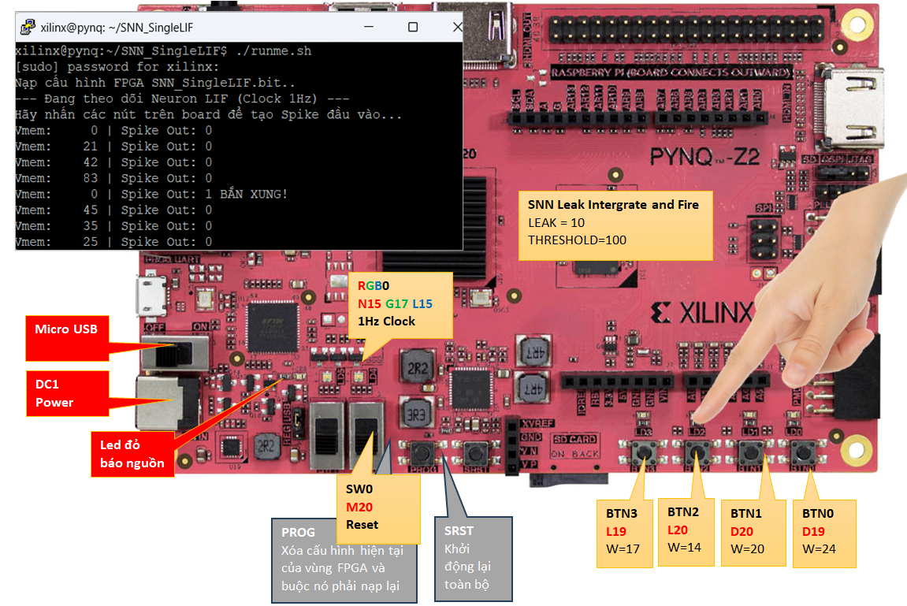

## Cơ sở lý thuyết

### Mô hình Toán học và Sinh học của Neuron LIF

Ảnh sau thể hiện một Neuron LIF (Leaky Integrate-and-Fire) hoạt động dựa trên điện thế màng Vmem:

$$V_{mem}(t) = V_{mem}(t-1) + \sum_{i=1}^{n} (Spike_i \times Weight_i) - Leak$$

### Mô hình Sinh học của Neuron LIF

- Bên trái ảnh là Mô hình sinh học: Tín hiệu đầu vào **Spikes** đi qua khớp thần kinh **Synapse** với trọng số **w** được tích lũy vào thân neuron. Nó có một cơ chế "rò rỉ" điện thế ra môi trường.
- Bên phải ảnh là đồ thị điện thế: đường cong Vmem đi lên khi có xung vào. Nếu không có xung, nó tự rò rỉ đi xuống (Leaky). Khi chạm vạch ngưỡng **Threshold**, nó phát ra một xung đầu ra (**Spike**) và lập tức **Reset** điện thế về 0.
  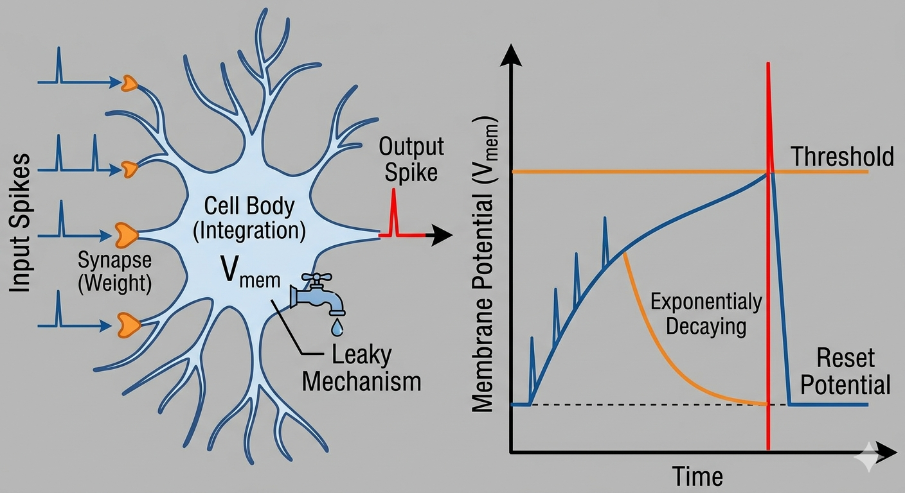\
  Nguồn Gemini

### Mô hình Software Programming

- Đây là **thuật toán leaky bucket**, là một dạng thuật toán điều khiển luồng, nhưng thay vì lấy dòng rò rỉ là đầu ra chính, thì nó lại dùng ngưỡng tràn là đầu ra chính.
- Một số neuron có **tốc độ rò rỉ nhanh**, đóng vai trò như bộ lọc nhiễu, nên chỉ phản ứng với các tín hiệu đến cực dồn dập. **tốc độ rò rỉ chậm** thì giống bộ nhớ dài hạn,
- Một số neuron có **ngưỡng threashold thấp**, chứng tỏ chúng cực kỳ nhạy cảm, dễ dàng phát hỏa chỉ với một vài tác động nhỏ. **ngưỡng threashold cao** chứng tỏ chúng rất điềm tĩnh, vô vi.

```python
import matplotlib.pyplot as plt
import random
import numpy as np

# --- 1. CẤU HÌNH THÔNG SỐ (Bộ giá trị thấp để dễ nhìn) ---
threshold = 100        # Ngưỡng phát xung
leak = 10              # Lượng rò rỉ mỗi chu kỳ
v_mem = 0              # Điện thế màng khởi tạo
weights = [12, 9, 17, 3] # Trọng số của 4 nguồn vào
time_steps = 50        # Giảm số chu kỳ để đồ thị thoáng hơn

# --- 2. KHỞI TẠO LỊCH SỬ ---
# Chúng ta sẽ lưu lịch sử theo cách "vẽ đường liên tục" (zigzag)
# bao gồm cả điểm Vmem vượt ngưỡng và điểm Reset về 0.
time_history = []
v_history = []
spike_times = []  # Lưu thời điểm bắn xung để vẽ dấu gạch

print(f"Bắt đầu mô phỏng Gàu nước LIF (Threshold: {threshold}, Leak: {leak})")
print("-" * 65)

# Đặt giá trị ban đầu vào lịch sử
current_time = 0
time_history.append(current_time)
v_history.append(v_mem)

# --- 3. MÔ PHỎNG ---
for t in range(1, time_steps + 1):
    # 3.1. Giả lập xung đầu vào (random)
    input_spikes = [random.choice([0, 1]) for _ in range(len(weights))]

    # 3.2. Tính năng lượng vào: sum(Spike_i * Weight_i)
    # Tư duy logic: (1*24) + (0*20) + (1*14) + (0*17)
    incoming_energy = sum(s * w for s, w in zip(input_spikes, weights))

    # 3.3. Tích lũy và Rò rỉ: V(t) = V(t-1) + Energy - Leak
    new_v_mem = v_mem + incoming_energy - leak

    # Đảm bảo Vmem không âm
    if new_v_mem < 0:
        new_v_mem = 0

    # --- 3.4. XỬ LÝ ĐIỂM "GÀU NƯỚC ĐỔ NGHIÊNG" ---
    if new_v_mem >= threshold:
        # Giai đoạn A: "Gàu đầy" - Nước dâng lên vượt ngưỡng
        current_time += 1.0  # Tăng thời gian
        time_history.append(current_time)
        v_history.append(new_v_mem) # <--- Vẽ điểm vượt ngưỡng
        spike_times.append(current_time) # Lưu thời điểm bắn xung

        # Giai đoạn B: "Đổ nước" - Thụt thẳng về 0 (Vertical reset)
        # Giả lập thời gian đổ nước cực ngắn (0.01) để đường thẳng đứng
        # current_time += 0.01  # Tăng thời gian cực nhỏ
        time_history.append(current_time) # <--- Thời gian giữ nguyên
        v_history.append(0)         # <--- Giá trị rơi về 0

        # Cập nhật giá trị Vmem thực tế về 0 cho chu kỳ sau
        v_mem = 0
        spike_str = "FIRE! 🚀"

    else:
        # Giai đoạn C: "Dâng nước thường" - Không chạm ngưỡng
        v_mem = new_v_mem
        current_time += 1.0
        time_history.append(current_time)
        v_history.append(v_mem)
        spike_str = "."

    # --- HIỂN THỊ KẾT QUẢ ---
    print(f"T={t:2} | Input Spikes: {input_spikes} | Energy: +{incoming_energy:<3} | V_mem (Peak): {v_mem:3} | {spike_str}")

print("-" * 65)

# --- 4. VẼ ĐỒ THỊ ---
plt.figure(figsize=(14, 7))

# Vẽ đường điện thế màng V_mem (zigzag liên tục)
plt.plot(time_history, v_history, color='#1f77b4', linewidth=2.5, label="Điện thế màng V_mem")

# Vẽ đường ngưỡng (Threshold)
plt.axhline(y=threshold, color='#d62728', linestyle='--', linewidth=2, label="Ngưỡng tràn (Threshold)")

# Vẽ vùng Reset (màu đỏ mờ sau Threshold)
plt.axhspan(threshold, max(v_history) + 10, color='#d62728', alpha=0.1, label="Vùng phát xung (Firing Zone)")

# Vẽ các vạch đứng biểu thị thời điểm bắn xung (Spike trains)
for st in spike_times:
    plt.axvline(x=st, color='#ff7f0e', linestyle=':', alpha=0.7, linewidth=1.5)
    # Vẽ mũi tên orange khi bắn xung
    plt.scatter(st, threshold + 8, color='#ff7f0e', marker='^', s=120, zorder=5)

# Tùy chỉnh đồ thị
plt.title("Mô phỏng Neuron LIF - Cơ chế Gàu nước rò rỉ và Đổ tràn (Reset)", fontsize=16)
plt.xlabel("Chu kỳ thời gian (Time Step / Clock Cycle)", fontsize=12)
plt.ylabel("Giá trị tích lũy (Nước trong gàu)", fontsize=12)
plt.xlim(0, max(time_history))
plt.ylim(-5, max(v_history) + 20)
plt.grid(True, which='both', linestyle='-', alpha=0.2)
plt.legend(loc='upper right', fontsize=10)

plt.tight_layout()
plt.show()
```

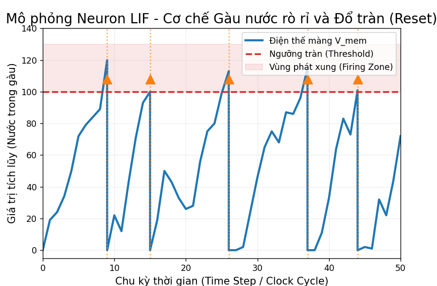

### Mô hình Hardware Design

- Sẽ một mạch dãy sequential logic với cac xung clock. 
- **Cơ chế tích lũy**: Vmem là một thanh ghi, kết hợp với bộ cộng nhưng với rất nhiều đầu vào tương ứng với các **Spike đầu vào** và Leak.
- **Cơ chế tích lũy**: Thiết kế một thanh ghi ngưỡng **Vthreshhold**, dùng và dùng bộ so sánh để xác định thượt ngưỡng để tạo ra xung **Spike đầu ra**
- **Cơ chế xóa tích lũy**  Tin hiệu **Spike đầu ra** vòng trở lại vào chân **reset** của thanh ghi **Vmem**.

**Các bước thiết kế:**

- Bước 1: Mã nguồn [lif_neuron.v1.v](./images/lif_neuron.v1.v) cho thấy cách thiết kế **chỉ cần chạy được**, với sự giúp đỡ của AI, kết hợp với mã nguồn khớp thần kinh để tính tổng năng lượng đầu vào [synapse_unit.v](./images/synapse_unit.v).
- Bước 2: Mã nguồn [lif_neuron.v2.v](./images/lif_neuron.v2.v) cho thấy cách thiết kế **phân rã module, hiệu suất cao, rõ ràng vởi phần mạch tổ hợp và thanh ghi tách biệt**.
- Bước 3: Kết hợp với phân tích RTL để **trực quan hóa và kiểm soát** bằng thiết kế dạng **block design**. 
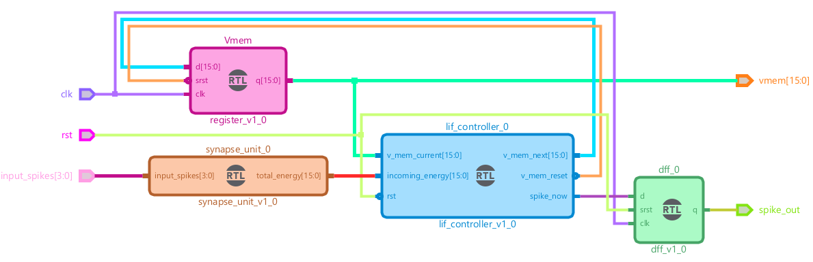

## Biên dịch chương trình System Test và triển khai lên Dev-Kit TUL PYNQ-Z2

### Biên dịch

1. **Mở project**:\
  Sử dụng phần mềm **Vivado** mở file dự án **SNN_SingleLIF.xpr**. \
  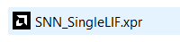

2. **Top Level**\
   Hãy chắc chắn rằng thiết kế Top Level đã là **system_intergration_wrapper** (được in đậm) như trong ảnh.
    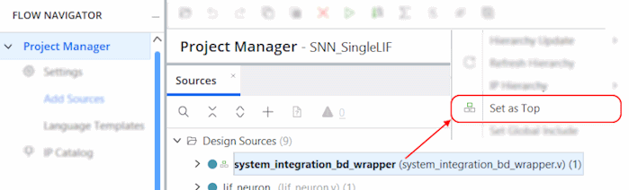

3. **Biên dịch**:\
  Trong thanh **Flow Navigator**, ở mục cuối **Program and Debug**, bấm **Generate Bitstream**.\
  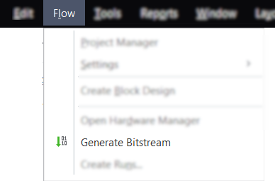\
   Hoặc cách khác là trên thanh **Top Menu**, chọn **Flow**, bấm **Generate Bitstream**.\
  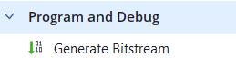

| Video |
| :------------: |
| [](https://youtu.be/2UxAF0Qpq-Y) |

### Triển khai trên Dev-Kit TUL PYNQ-Z2

Video cấp nguồn và khởi động kit:
  [](https://youtu.be/3wKUKkg7544) |

1. Copy các file cấu hình FPGA lên kit **TUL PYNQ-Z2**.\
   Chạy script **.\CollectBitStream.py** trong thư mục dự án, để đẩy các file [**.bit** và **.hwh**](https://neittien0110.github.io/FPGA-DevKits/Vivado.html#m%E1%BB%91i-quan-h%E1%BB%87-gi%E1%BB%AFa-file-bit-v%C3%A0-hwh) lên dev-kit.

   ```shell
    python .\CollectBitStream.py
    🚀 Dự án: SNN_SingleLIF
    ---------------------------------------------
    📝 BIT found: 2026-05-22 13:52:23 (7 phút trước)
    📝 HWH found: 2026-05-21 21:23:19 (996 phút trước)
    ---------------------------------------------
    📡 Đang kết nối tới PYNQ (192.168.2.99)...
    📤 Uploading BIT... OK
    📤 Uploading HWH... OK
    ---------------------------------------------
    ✅ THÀNH CÔNG! File đã nằm tại: /home/xilinx/SNN_SingleLIF
    💡 Trong Jupyter, bạn gọi: Overlay('SNN_SingleLIF.bit')
   ```

2. Copy các file chương trình chạy trên **ARM core** lên kit PYNQ-Z2, để trong cùng thư mục dự án.
    - **systemtest.py**
    - **runme.sh**
  
    Kết quả thư mục dự án trên **PYNQ-Z2** như sau (ảnh từ [WinSCP](https://winscp.net/eng/download.php)):\
  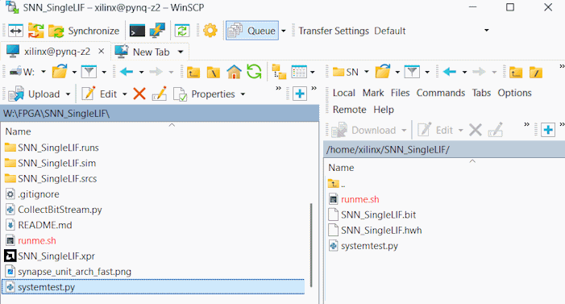

3. Truy cập vào kit **PYNQ-Z2** qua **ssh**. Tải khoản xilinx, mật khẩu xilinx.

    ```console
    ssh xilinx@192.168.2.99
    ```

4. Vào thư mục dự án hiện thời.\
  Cấp quyền thực thi **x** cho file **./runme.sh**

    ```shell
    xilinx@pynq:~$ cd SNN_SingleLIF/
    xilinx@pynq:~/SNN_SingleLIF$ chmod +x ./runme.sh
    ```

| Video |
| :------------: |
| [](https://youtu.be/mC-djHauMh8) |

### Chạy chương trình

1. Truy cập vào kit **PYNQ-Z2** qua **ssh**. Tải khoản xilinx, mật khẩu xilinx.

    ```console
    ssh xilinx@192.168.2.99
    ```

2. Thực thi file chạy dự án.

    ```shell
    xilinx@pynq:~$ cd SNN_SingleLIF/
    xilinx@pynq:~/SNN_SingleLIF$ ./runme.sh
    [sudo] password for xilinx:
    Nạp cấu hình FPGA SNN_SingleLIF.bit..
    --- Đang theo dõi Neuron LIF (Clock 1Hz) ---
    Hãy nhấn các nút trên board để tạo Spike đầu vào...
    Vmem:     0 | Spike Out: 0
    Vmem:    27 | Spike Out: 0
    Vmem:    34 | Spike Out: 0
    Vmem:    62 | Spike Out: 0
    Vmem:    76 | Spike Out: 0
    Vmem:    80 | Spike Out: 0
    Vmem:    70 | Spike Out: 0
    Vmem:    60 | Spike Out: 0
    Vmem:    64 | Spike Out: 0
    Vmem:     0 | Spike Out: 1 BẮN XUNG!
    Vmem:    45 | Spike Out: 0
    Vmem:    35 | Spike Out: 0
    ```

   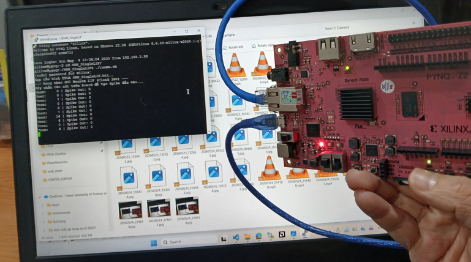

| Video |
| :------------: |
| [](https://youtu.be/3wKUKkg7544) |

## Thiết kế 1 neuron bằng code Verilog trực tiếp

Viết [code Verilog trực tiếp](./SNN_SingleLIF.srcs/sources_1/new/lif_neuron.v)

## Thiết kế trực quan LIF bằng Block Diagram

**Lưu ý**: sau khi sửa file Block Diagram, bắt buộc phải chạy lại **Generate Output Products**. Còn chức năng **Create HDL Wrapper** thì chỉ cần chạy lần đầu tiên sau khi thiết kế xong Block Diagram
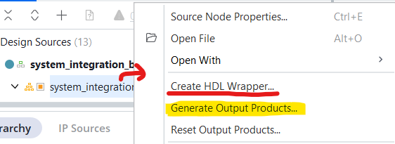

### Toàn bộ LIF bằng Block Diagram


- Module [**synapse_unit**](#module-synapse_unit) thể hiện việc tính tổng tích lũy các spike đầu vào và trọng số tương ứng
- Module [**V_mem**](#module-v_mem) chỉ là một thành ghi vào/ra song song, với tham số độ rộng bus **Width=16**.
- Module [**dff_0**](#module-flipflop-d) chỉ là một Flip Flop D để chốt xung **Spike** đầu ra, triệt tiêu hazard.
- Module [**controller**](#module-controller) là thuật toán quan trọng để xử lý 3 thao tác: tăng, giảm, so sánh điện thế màng Vmem.

Khi sử dụng công cụ **RTL Analysis** trong thanh **Flow Navigation**,
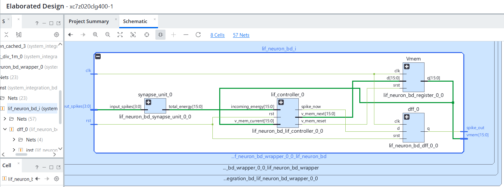

### Module synapse_unit

Các khớp thần kinh nối. [**Mã nguồn Verilog**](./SNN_SingleLIF.srcs/sources_1/new/register.v).

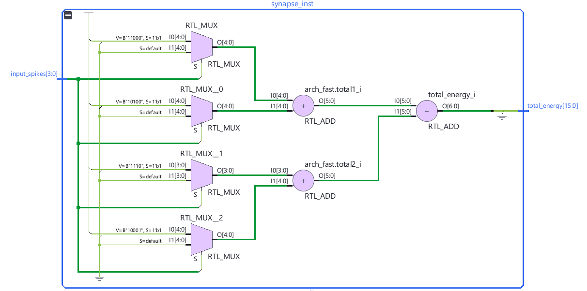
[Back to parent design](#thiết-kế-trực-quan-lif-bằng-block-diagram)

### Module V_mem

- Là thanh ghi [**Mã nguồn Verilog**](./SNN_SingleLIF.srcs/sources_1/new/synapse_unit.v).
- vào song song, ra song song
- Tùy biến được độ rộng bus với tham số **Width=16**.

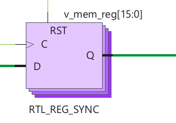
[Back to parent design](#thiết-kế-trực-quan-lif-bằng-block-diagram)

### Module FlipFlop D

- Là thanh ghi 1 bit [**Mã nguồn Verilog**](./SNN_SingleLIF.srcs/sources_1/new/dff.v).
- Là một Flip Flop D để chốt xung **Spike** đầu ra, có tác dụng triệt tiêu hazard.

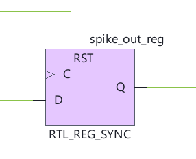
[Back to parent design](#thiết-kế-trực-quan-lif-bằng-block-diagram)

### Module Controller

- Là mạch tổ hợp [**Mã nguồn Verilog**](./SNN_SingleLIF.srcs/sources_1/new/lif_controller.v).
- Kiếm soát việc tăng Vmem theo spike đâu vào
- Kiểm soát việc trừ Vmem định kì (rò rỉ)
- Kiểm soát so sánh ngưỡng để tạo xung Spike đầu ra.
- Khi phát sinh Spike đầu ra thì đồng thời xóa Vmem về 0.

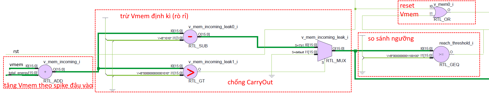

## Thiết kế System Test / Giao tiếp FPGA vs ARM core

### Thiết kế khối System Test

- Thiết kế chính bằng Block Diagram.
- Bổ sung thêm các khối để tương tác với **ARM Core**.\
  Trong **Block Design**, kéo thả các khối
  - **ZYNQ7 Processing System**,
  - **AXI GPIO**,\
     và cho hệ thống tự bổ sung các khối còn lại là
    - **AXI Smart Connect**,
    - **Processor System Reset**
- Do mục tiêu *dùng 4 nút Button để tạo xung Spike đầu vào, và Led để báo hiệu trạng thái bấm đã được ghi nhận* nên sẽ nối **AXI GPIO** với 4 led ngoài nên sẽ
  - dùng tính năng **Make External** để nối với chân pin cứng trên FPGA
  - Tìm thông tin về **Base Address** của khối này trong tab **Address Editor** của toàn bộ **Block Design**
- Tạo thiết kế SoftIP mới để điều khiển led đơn. **Project Manager / Add Sources**. \
   Đặt tên SoftIP là **decoder_2to4.v**
- Tích hợp **decoder_2to4.v** vào design chung trong **Block Design** bằng tính năng **Add Module**.
- Gán **chân pin mềm của SoftIP top design** với **chân pin cứng cùa FPGA** bằng cách chạy **Run Systhesis** và mở cửa sổ **Top menu / Layout / IO Planning**.

### Triển khai trên board

- Trong thanh **Flow Navigator**, thực hiện **Implementation**. 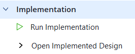
- Ánh xạ chân pin của FPGA và chân pin của IP core mới thiết kế

  Board Parts | FPGA Pin | My Design
  --: | :--: | :--
  SW0, với 2 giá trị 3v3 và 0v | M20 | srst_0
  BTN0, tích cực mức cao | D19 | buttons(0)
  BTN1, tích cực mức cao | D20 | buttons(1)
  BTN2, tích cực mức cao | L20 | buttons(2)
  BTN3, tích cực mức cao | L19 | buttons(3)
  LED0, tích cực mức cao | R14 | led0
  LED1, tích cực mức cao | P14 | led1
  LED2, tích cực mức cao | N16 | led2
  LED3, tích cực mức cao | M14 | led3
  rgb_leds[0], R | N15 | clk1hz

  Đồng thời đặt mức điện áp I/O std của tất cả các chân pin là LVCMOS33
  
## Simulation và Testbench

### Cách tạo một Testbench mới

1. Trong **Flow Navigation** bar, trong mục **Project Manager** chọn **Add Source**.\
    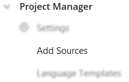
2. Ở cửa sổ **Add Source**, chọn **Add or create simulation sources**.\
  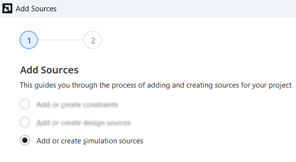
3. Click **Create File**.\
   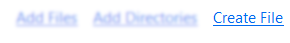
4. Ví dụ về testbench, file [tb_lif_neuron.v](./SNN_SingleLIF.srcs/sim_1/new/tb_lif_neuron.v), file [tb_lif_neuron2.v](./SNN_SingleLIF.srcs/sim_1/new/tb_lif_neuron2.v)

### Chạy Testbench/Giả lập

1. **Top Level** của Simulation là riêng, không trùng với Top Level của việc biên dịch:\
   Hãy chắc chắn rằng thiết kế Top Level đã file mong muốn (được in đậm). Ví dụ như trong ảnh\
    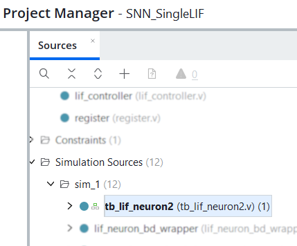
2. Trong **Flow Navigation** bar, trong mục **Simulation** chọn **Run Simulation**.\
   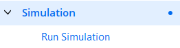
3. Ví dụ về một Waveform kết quả.\
    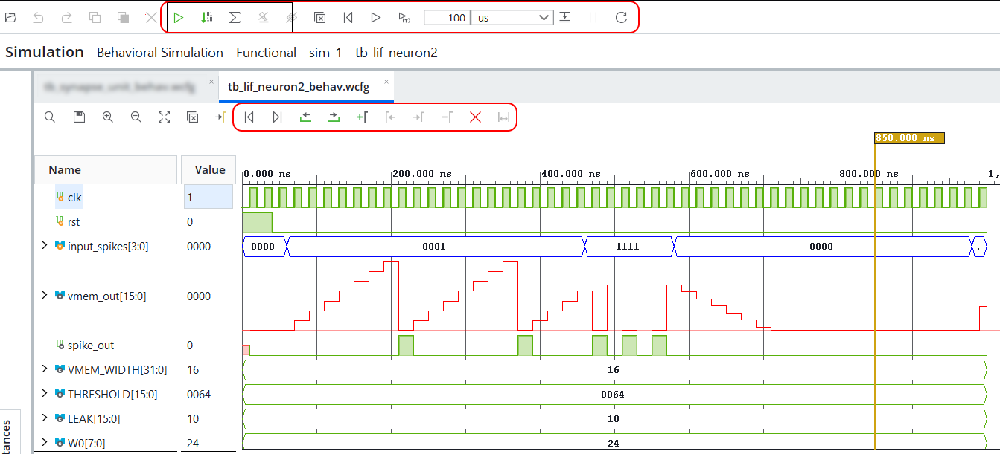
